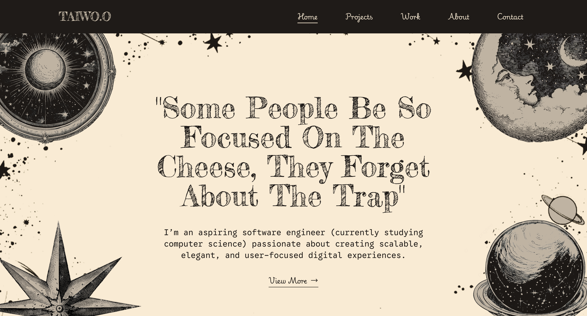

## 💼 Portfolio Website
[Link to Portfolio](https://portfolio-one-taupe-52.vercel.app/)

🚀 **Tech Stack:** React • TypeScript • Framer Motion • Tailwind CSS • Github API • etc.

A sleek, responsive, and animation-rich portfolio to highlight my **projects**, **skills**, **experience**, and **about me**.  
*LIVE - Up and Running*

*Can't show files as it contains API keys and what not. I could remove those files but I don't want to end up accidentally missing something, if you get what I mean*
